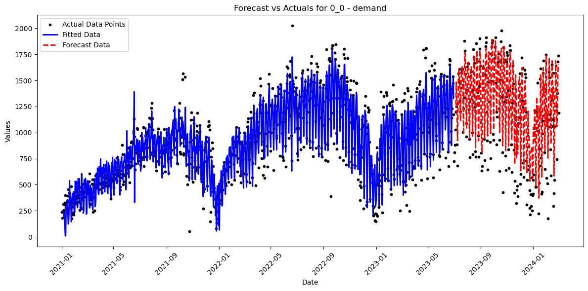
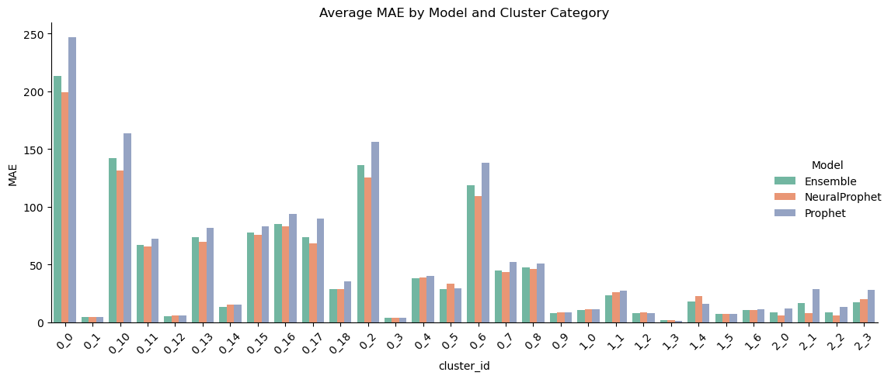
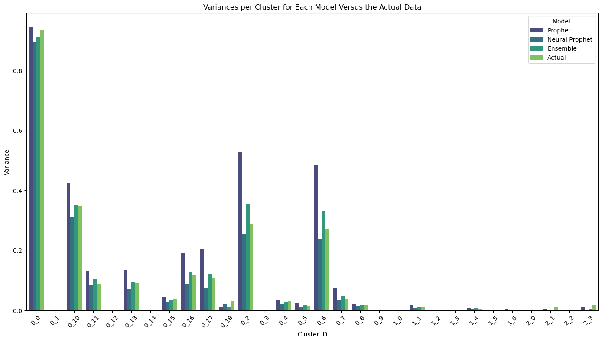

# Bay Wheels GBFS Data Processing 

This repository contains two Python scripts designed for processing Bay Wheels bike share data provided by Lyft for the Bay Area, including San Francisco, Oakland, and San Jose. These tools facilitate the retrieval and processing of both static and real-time General Bikeshare Feed Specification (GBFS) data, making it simpler for users to analyze bike share usage patterns, availability, and system health. Data available at (data license available at [Bay Wheels System Data](https://www.lyft.com/bikes/bay-wheels/system-data))

In addition to the above and as a case study, the static data from January 2021 to February 2024 was used to conduct a comparison between the performance of the Prophet and NeuralProphet forecasting models as well as their ensemble.


## Case Study: Forecasting Bike Share Demand with Prophet, Neural Prophet, and Ensemble Methods

### Overview

Utilizing static data spanning from January 2021 to February 2024, this case study delves into the comparative performance of the Prophet, Neural Prophet, and an ensemble of these forecasting models. The primary goal is to identify the most effective approach for predicting bike sharing demand and supply, accounting for external factors like weather conditions and exceptional events (e.g., holidays).

### Data Preparation

The GBFS dataset, initially containing approximately 7 million records, underwent a rigorous cleaning process to address missing station IDs by leveraging geographical coordinates. Subsequent clustering via DBSCAN and KMeans algorithms facilitated the identification of three major regions and 30 sub-clusters, optimizing the dataset for predictive analysis.

### Predictive Modelling and Evaluation

The study employed an 80:20 split for training and testing the models, with the training set covering data from January 2021 to June 2023 and the testing set from July 2023 to February 2024. Model performance was assessed using metrics such as MAE, RMSE, and MAPE, across both demand and supply predictions.

### Insights and Findings

- The ensemble method somtimes performed on par or superior to both the Prophet and Neural Prophet models.
- The Neural Prophet model displayed a pronounced sensitivity to data variance, attempting to capture fluctuations as accurately as possible.
- An unconventional approach of averaging variances for supply and demand was adopted for comparative analysis, justified by the similarity of variances across clusters.

### Visualizations

- Regions Identified in the Data (San Francisco in red, Oakland in Blue and San Jose in Green)
  
- Example of Prophet Model Fitting for cluster 0_0
  
- Example of Neural Prophet Model Fitting for cluster 0_0
  
- Comparative Bar Plots of Model MAE
  
- Variance Analysis between Actual and Fitted Data
  

This case study highlights the potential of ensemble methods in enhancing forecasting accuracy by combining the unique strengths of the Prophet and Neural Prophet models, particularly in scenarios characterized by high data variability.

## Description

The Bay Wheels data, made available thanks to Lyft Bike Share and Scooters (data license available at [Bay Wheels License Agreement](https://baywheels-assets.s3.amazonaws.com/data-license-agreement.html)), encompasses comprehensive information about the bike share system, including station locations, bike availability, and system updates. The data is divided into two categories:

- **Static Data:** Updated monthly, covering system information like station details and historical usage data. The `GBFSStaticData` script allows users to download this data, select specific months for analysis, and automatically handles variations in data schemas across different years, exporting distinct CSV files as necessary.

- **Real-time Data:** Provides live updates on the system, such as bike availability and system status. The `GBFSRealTimeData` script accepts parameters for duration and interval, fetching and storing the data in JSON format for the specified feeds. For longer durations, users are encouraged to modify the storage approach to optimize data relevance and minimize redundancy.

## Getting Started

### Prerequisites
- Python 3.12
- Pip for Python package installation

### Installation
1. Clone the repository to your local machine:
   ```sh
   git clone https://github.com/erfanhajibandeh/gbfs-bikeshare-forecasting.git
   ```
2. Install the required Python packages:
   ```sh
   pip install -r requirements.txt
   ```
### Usage

#### Static Data

To use the `GBFSStaticData` script:
1. Run the script in your terminal or command prompt.
2. Follow the interactive prompts to select the data files you wish to download and process.

#### Real-time Data

To use the `GBFSRealTimeData` script:
1. Specify the base URL and the feeds you're interested in within the script.
2. Run the script and enter the desired duration and interval when prompted.
3. The script will download and process the data, storing it in JSON format.

## License

This project is open-source and available under the Bay Wheels License Agreement License.

## Acknowledgments

- Data provided courtesy of Lyft Bay Wheels.
- [Lyft Data License Agreement](https://baywheels-assets.s3.amazonaws.com/data-license-agreement.html)

## Contact
For any questions or suggestions regarding this project, please contact me.
